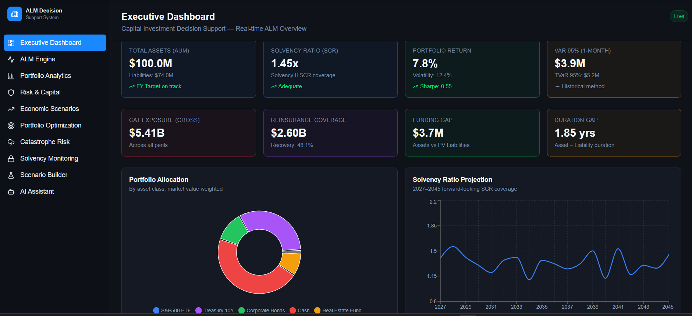

# 🚀 Capital Insight System

<div align="center">

# Enterprise Insurance Asset-Liability Management (ALM) Decision Support System

A comprehensive enterprise-grade platform for Insurance Asset-Liability Management, Portfolio Analytics, Risk Assessment, Solvency Monitoring, Catastrophe Risk Modeling, Scenario Analysis, Portfolio Optimization, and AI-Powered Decision Support.


</div>

---

## 📸 Dashboard Preview


---

# 🎯 Project Overview

Capital Insight System is an enterprise-grade decision intelligence platform designed for insurance companies to manage:

- Asset-Liability Management (ALM)
- Solvency Monitoring
- Catastrophe Risk Analytics
- Portfolio Optimization
- Risk Capital Assessment
- Economic Scenario Simulation
- AI-Based Decision Support

The platform combines financial engineering, insurance analytics, risk management, and artificial intelligence into a unified decision support environment.

---

# 🏗 System Architecture

```text
Market Data Sources
(FRED, Treasury, VIX, S&P500)
            │
            ▼
    Data Processing Layer
            │
            ▼
   ALM & Risk Analytics Engine
            │
 ┌──────────┼──────────┐
 ▼          ▼          ▼
Portfolio  Solvency  Catastrophe
Analytics Monitoring Analytics
 └──────────┼──────────┘
            ▼
   Scenario & Optimization
            │
            ▼
     AI Decision Assistant
            │
            ▼
     Executive Dashboard
```

---

# 📦 Technology Stack

## Frontend

- React
- TypeScript
- Vite
- Tailwind CSS
- Recharts
- React Query

## Backend

- Node.js
- Express.js
- TypeScript

## Analytics

- Mean Variance Optimization
- Solvency II Analytics
- VaR & TVaR
- ALM Models
- Stress Testing

## AI Layer

- OpenAI Integration
- Context-Aware Portfolio Analysis
- Decision Intelligence Assistant

---

# 🏆 Platform Modules

## 📊 Module 1 — Executive Dashboard

### Key Metrics

- Total Assets Under Management
- Solvency Ratio (SCR)
- Portfolio Return
- VaR 95%
- Catastrophe Exposure
- Reinsurance Coverage
- Funding Gap
- Duration Gap

### Visualizations

- Portfolio Allocation
- Solvency Projection
- Enterprise Risk Heatmap

---

## ⚖️ Module 2 — ALM Engine

### Features

- Liability Projection
- Duration Analysis
- Convexity Analysis
- BPV / DV01 Calculation
- Cashflow Matching

### Visualizations

- Liability Cashflow Projection
- Duration Distribution
- Cashflow Surplus Analysis

---

## 📈 Module 3 — Portfolio Analytics

### Metrics

- Sharpe Ratio
- Alpha
- Beta
- Maximum Drawdown

### Features

- Portfolio Holdings Analysis
- Capital Requirement Assessment
- Sector Exposure Analytics

---

## ⚠️ Module 4 — Risk & Capital Engine

### Analytics

- Historical VaR
- Parametric VaR
- TVaR
- Return Distribution

### Visualizations

- Rolling Volatility
- Drawdown Analysis
- Capital Charge Breakdown

---

## 🌎 Module 5 — Economic Scenario Generator

### Data Sources

- Treasury Yields
- VIX
- GDP
- Credit Spreads

### Scenarios

- Bull Market
- Bear Market
- High Inflation
- Recession
- Rate Shock
- Credit Widening

---

## 🎯 Module 6 — Portfolio Optimization

### Capabilities

- Mean Variance Optimization
- Efficient Frontier
- Risk Budget Allocation
- Optimal Portfolio Generation

---

## 🌪 Module 7 — Catastrophe Risk Analytics

### Risk Categories

- Flood
- Hurricane
- Tornado
- Wildfire

### Features

- Geographic Exposure Analysis
- Cat Bond Portfolio
- ILS Sidecars
- Reinsurance Structures

---

## 🛡 Module 8 — Solvency Monitoring

### Solvency II Analytics

- SCR Projection
- Capital Adequacy Tracking
- Coverage Ratio Monitoring

### Components

- Market Risk
- Underwriting Risk
- Counterparty Risk
- Operational Risk

---

## 🔮 Module 9 — Scenario Builder

### Interactive Factors

- Equity Shock
- Interest Rate Shock
- Credit Shock
- Inflation Shock
- GDP Shock
- Catastrophe Multiplier

### Historical Templates

- 2008 Global Financial Crisis
- 2020 COVID Crash
- 2022 Rate Shock

---

## 🤖 Module 10 — AI Decision Assistant

### Features

- Portfolio Intelligence
- Risk Interpretation
- Capital Recommendations
- Solvency Insights
- Scenario Analysis

### Example Queries

```text
How does a 200bps rate increase affect solvency?

Recommend an optimal allocation.

Explain current catastrophe exposure.

What is driving SCR requirements?
```

---

# 🚀 Local Installation

## Clone Repository

```bash
git clone https://github.com/your-username/capital-insight-system.git

cd capital-insight-system
```

## Install Dependencies

```bash
pnpm install
```

---

## Start Backend

```bash
cd artifacts/api-server

export PORT=3000

pnpm run dev
```

---

## Start Frontend

```bash
cd artifacts/alm-dss

pnpm dev
```

---

## Access Application

```text
Frontend:
http://localhost:5173

Backend:
http://localhost:3000
```

---

# 📊 Screenshots

## Executive Dashboard


## ALM Engine


## Portfolio Analytics


## Risk Engine


## Scenario Builder


## AI Assistant


---

# 🎓 Learning Outcomes

- Enterprise Financial Systems
- Insurance Risk Analytics
- Asset Liability Management
- Solvency II Framework
- Portfolio Optimization
- Catastrophe Risk Modeling
- AI-Powered Decision Support

---

# 👨‍💻 Author

## Ritesh Sharma

Industrial Engineering Student

BS Data Science – IIT Madras

Interests:

- Financial Engineering
- Reliability Engineering
- AI Systems
- Decision Intelligence Platforms
- Enterprise Analytics

---

<div align="center">

### ⭐ If you found this project interesting, consider giving it a star.

</div>